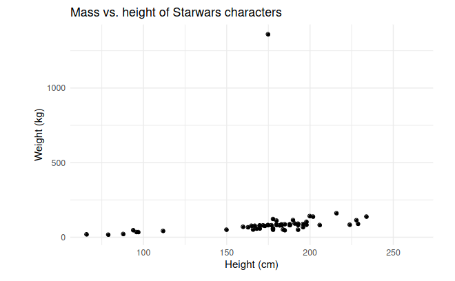
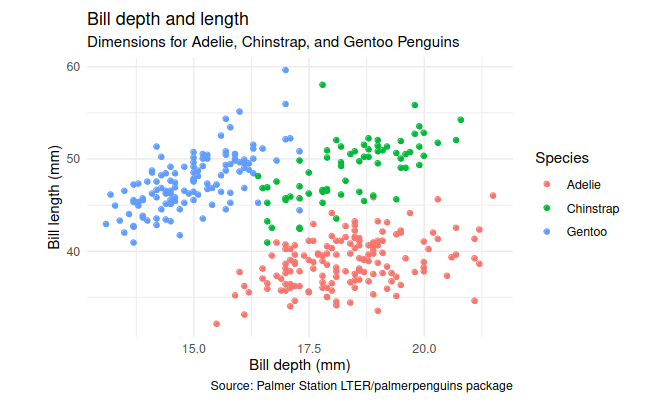
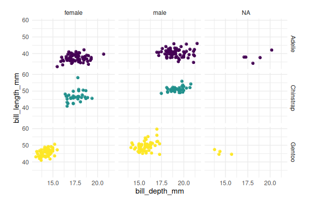
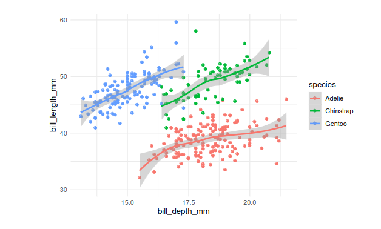

## 2.1 Data and visualization
>In a dataset, each row is an **observation** and each column is a **variable**.

#### Exploratory data analysis
Exploratory data analysis (EDA) is an approach to analyzing data sets to summarize their main characteristics.
Often, EDA is visual – this is what we’ll focus on first.
But we might also calculate summary statistics and perform data transformation at (or before) this analysis stage – this is what we’ll focus on next.

#### ggplot2: 
Data visualization is the creation and study of the visual representation of data.  
Many tools exist for visualizing data, and R is one of them.

>ggplot2 is tidyverse’s data visualization package, i.e., ggplot2 is loaded after running. The gg stands for **Grammar of Graphics**:  tool that enables
us to concisely describe the components of a graphic.

```
library(tidyverse)
```
Let’s look at the plot of mass vs. height of Star Wars characters:
```
ggplot(
    data= starwars,
    mapping = aes(x = height, y = mass)
) + 
geom_point() +
labs(
    title = "Mass vs. height of Starwars characters",
    x="Height (cm)", y="Weight(kg)"
)
```
  

>ggplot() is the main function in ggplot2. It initializes the plot. The different layers of the plots are then added consecutively.

#### example with the dataset penguins from the package palmerpenguins

>The function aes() creates the mapping from the dataset variables to the plot’s aesthetics.  
Represent each observation with a point by using geom_point().  
Map species to the colour of each observation point.  
Title the plot “Bill depth and length”.  
Add the subtitle “Dimensions for Adelie, Chinstrap, and Gentoo Penguins”.
Label the x- and y-axis as “Bill depth (mm)” and “Bill length (mm)”, respectively  
Label the legend “Species”  
Add a caption for the data source.  
use a discrete colour scale to be perceived by viewers with common colour blindness. (+ scale_colour_viridis_d())  


```
library(palmerpenguins)

ggplot(data = penguins,
       mapping = aes(x = bill_depth_mm,
                     y = bill_length_mm,
                     colour = species)) + 
    geom_point() +
    labs(
      title = "Bill depth and length",
      subtitle = "Dimensions for Adelie, Chinstrap, and Gentoo Penguins",
      x = "Bill depth (mm)", y = "Bill length (mm)",
      colour = "Species",
      caption = "Source: Palmer Station LTER/palmerpenguins package")

```  
  

#### Aesthetics:
Commonly used aesthetics of a graphic are **colour, shape, size or alpha (transparency)**  
Remark. The values of shape can only be specified by a discrete variable. Using instead a continuous
variable will lead to an error.

#### Mapping vs setting:
<div style='background-color:gray;'>
<span>
<b>Mapping:</b> Determine the size, alpha, etc., of the geometric objects, like points, based on the values
of a variable in the dataset.  
Use aes() to define the mapping. <br>
<b>Setting:</b> Determine the size, alpha, etc., of the geometric objects, like points, not based on the values
of a variable in the dataset.  
Specify the aesthetics within geom_*()
</div>  
<br>

mapping: 
```
ggplot(
 penguins,
 aes(
  x = bill_depth_mm,
  y = bill_length_mm,
  size = body_mass_g,
  alpha = flipper_length_mm)) +
 geom_point()
```

setting:
```
ggplot(penguins,
  aes( x = bill_depth_mm, y = bill_length_mm)) +
  geom_point(
  size = 2,
  alpha = 0.5)
```

#### Faceting:
>Faceting means creating smaller plots that display different subsets of the data. Useful for exploring conditional relationships and large data.  

<div style='background-color:gray;'>
<span>
<b>facet_grid():</b>
<ul>
<li>able to create 2d grid</li>    
<li>rows ~ cols </li>
<li>use . for no split in rows or columns</li>
</ul>
<b>facet_wrap():</b> 1d ribbon wrapped according to the number of rows and columns specified or
available plotting area
</div>
<br>

**Facets based on variables defining aesthetics** 
When facets are built based on a variable used for coloring, the output will contain an unnecessary
legend.  
The information about the different species is already shown on the y-axis and, hence, doesn’t need to be repeated in the legend. One can remove the legend using either **guides()**,
or **theme(legend.position = "none")**.
```
ggplot(
  penguins,
  aes(x = bill_depth_mm, y = bill_length_mm,
    color = species)) +
  geom_point() +
  facet_grid(species ~ sex) +
  scale_color_viridis_d() +
  guides(color = FALSE)
```
  

#### Geoms:
Other geoms are applied analogously to geom_point(). One can also combine several geoms in one
plot.  
Different geoms describe different aspects of the data, and the choice of the appropriate geom
also depends on the type of the data.
```
ggplot(penguins, aes(x = bill_depth_mm, y = bill_length_mm,
  color = species)) +
  geom_point() +
  geom_smooth()
```  
 


