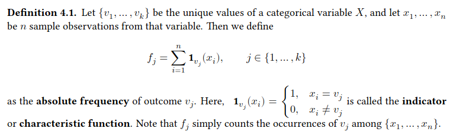
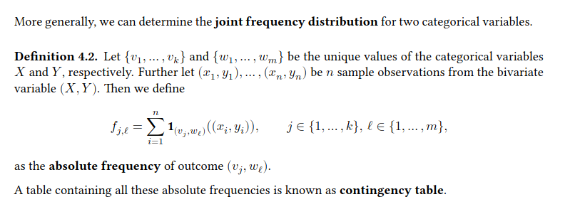

## Experiments: Explore Data
#### 1- Exlporing Categorical Data:
The used Data Set is:  **loans_full_schema** which is contained in
the openintro package and includes thousands of loans made through the Lending Club, which is a platform that allows individuals to lend to other individuals. 

We will examine the relationship between the two variables
- **homeownership**, which can take one of the values of rent, mortgage (owns but has a mortgage),
or own, and
- **application_type**, which indicates whether the loan application was made with a partner (joint) or whether it was an individual application.

The data requires some data cleaning.
```
loans <- loans_full_schema |>
    mutate(
        # lower case letters
        homeownership = tolower(homeownership),
        # pick new levels
        homeownership = fct_relevel(
        homeownership,
        "rent", "mortgage", "own"
    ),
    application_type = fct_relevel(
        as.character(application_type),
        "joint", "individual"
        )
    )
```


###### Frequency Distribution: 



We get the following absolute frequencies for homeownership and application_type.
```
loans |>
    count(homeownership)
```

```
loans |>
    count(application_type)
```

Instead of absolute frequencies, we can compute the **relative frequencies** (proportions): $r_{j} = \frac {f_{j}}{n}$ 

```
loans |>
    count(homeownership) |>
    mutate(prop = n / sum(n))
```

###### Bar chart:
>A bar chart is a common way to display the distribution of a single categorical variable.
In ggplot2 we can use geom_bar() to create a bar chart.

```
ggplot(loans, aes(x = homeownership)) +
    geom_bar(fill = "gold") +
    labs(x = "Homeownership", y = "Count")
```
###### Computed variables:
In the previous plot, we did not present the data as they are. In a preliminary step, absolute frequencies were calculated for homeownership and then these values were plotted.

>Each geom has its own set of variables to be calculated. For geom_bar() these are:

Computed variables: These are calculated by the 'stat' part of layers and can be accessed with delayed evaluation. 
- after_stat(count) number of points in bin.
- after_stat(prop) groupwise proportion
  
> The help page of each geom function contains a list with all computed variables, where the first entry is the default computation.

To create a bar chart of relative frequencies (not absolute), we first have to apply the statistical transformation prop to the whole data set.
after_stat(prop) computes groupwise proportions. The data contains three groups concerning homeownership. If we want to calculate proportions for each group with respect to the size of the whole dataset, we first have to assign a common group value (e.g., group = 1) for all three groups.
```
ggplot(loans,
 aes(x = homeownership,
     y = after_stat(prop), group = 1)) +
 geom_bar(fill = "gold") +
 labs(x = "Homeownership")
```

###### Frequency distribution for two variables:


###### Computing contingency tables
```
loans |>
    select(homeownership, application_type) |>
    table() 

#               application_type
# homeownership joint individual
#   rent        362 3496
#   mortgage    950 3839
#   own         183 1170
```
We can also add the marginal frequency distributions.
```
loans |>
    select(homeownership, application_type) |>
    table() |>
    addmargins()

#               application_type
# homeownership joint individual Sum
# rent          362     3496    3858
# mortgage      950     3839    4789
# own           183     1170    1353
# Sum           1495    8505    10000
```
>Contingency tables can also be computed using count().

> prop.table() converts a contingency table with absolute frequencies into a table with proportions.

```
loans |>
    select(homeownership, application_type) |>
    table() |>
    prop.table()

#               application_type
# homeownership joint individual
# rent          0.0362 0.3496
# mortgage      0.0950 0.3839
# own           0.0183 0.1170
```
To add row and column proportions, one can use the margin argument.   
For row proportion (absolute frequencies divided by the row totals), we have to use margin=1

```
loans |>
    select(homeownership, application_type) |>
    table() |>
    prop.table(margin = 1) |>
    addmargins()

#                   application_type
# homeownership joint     individual Sum
# rent          0.0938310 0.9061690 1.0000000
# mortgage      0.1983713 0.8016287 1.0000000
# own           0.1352550 0.8647450 1.0000000
# Sum           0.4274573 2.5725427 3.0000000
```

>Row and column proportions can also be thought of as **conditional proportions** as they tell us about the proportion of observations in a given level of a categorical variable conditional on the level of another categorical variable.

###### Bar charts with two variables
>We can plot the distributions of two categorical variables simultaneously in a bar chart. Such charts are generally helpful to visualize the relationship between two categorical variables.
```
ggplot(loans, aes(x = homeownership, fill = application_type)) +
    geom_bar() +
    scale_fill_brewer(palette = "Set1") +
    labs(
        x = "Homeownership", y = "Count", fill = "Application type",
        title = "Stacked bar chart"
    )
```
Loan applicants most often live in homes with mortgages. But it is not so easy to say how the different types of applications differ over the levels of homeownership.
The stacked bar chart is most useful when it’s reasonable to assign one variable as the explanatory variable (here homeownership) and the other variable as the response (here application_type) since we are effectively grouping by one variable first and then breaking it down by the others.

One can vary the bars’ position with the position argument of geom_bar()
```
ggplot(loans, aes(x = homeownership, fill = application_type)) +
 geom_bar(position = "dodge") +
 scale_fill_brewer(palette = "Set1") +
 labs(
    x = "Homeownership", y = "Count", fill = "Application type",
    title = "Dodged bar chart"
 )
```

Dodged bar charts are more agnostic in their display about which variable, if any, represents the explanatory and which is the response variable. It is also easy to discern the number of cases in the six group combinations. However, one downside is that it tends to require more horizontal space.
Additionally, when two groups are of very different sizes, as we see in the group own relative to either of the other two groups, it is difficult to discern if there is an association between the variables.  

A third option for the position argument is fill. Using this option makes it easy to compare the distribution within one group over all groups in the dataset. But we have no idea about the sizes of the different groups.

```
ggplot(loans, aes(x = homeownership, fill = application_type)) +
 geom_bar(position = "fill") +
 scale_fill_brewer(palette = "Set1") +
 labs(
     x = "Homeownership", y = "Count", fill = "Application type",
     title = "Filled bar chart"
     )
```


###### Mosaic plots: 
>A mosaic plot is a visualization technique for contingency tables that is similar to a filled bar chart with the benefit that we still see the relative group sizes. We can use geom_mosaic() from the ggmosaic package to create such a plot

```
library(ggmosaic)
 ggplot(loans) +
 geom_mosaic(aes(x = product(homeownership), fill = application_type)) +
 scale_fill_brewer(palette = "Set1") +
 labs(x = "Homeownership", y = "Application type") +
 guides(fill = "none") # no legend
```
Each column represents a level of homeownership, and the column widths correspond to the proportion of loans in each category.  
Mosaic plots use box areas to represent the number of cases in each category.
We can again use this plot to see that the homeownership and application_type variables are associated since some columns are divided in different vertical locations than others.

###### Pie charts:
>Pie charts can work for visualizing a categorical variable with very few levels.

```
loans |>
    count(homeownership) |>
    ggplot(aes(x="", y=n, fill=homeownership)) +
    geom_bar(stat="identity", width=1, color="white") +
    geom_text(aes(label = n),
        position = position_stack(vjust = 0.5)) +
    coord_polar("y", start=0) +
    theme_void()
```

However, they can be pretty tricky to read when they are used to visualize a categorical variable with
many levels.
Hence, it would be best if you never used a pie chart. Use a bar chart instead. But if you really want
to, use a waffle chart.

###### Waffle chart:
Waffle charts can be used to communicate the proportion of the data that falls into each level of a categorical variable. We use geom_waffle() from the ggwaffle package to create the chart.
```
library(ggwaffle)
waffle_data <- waffle_iron(
    loan50, # sample of size 50
    aes_d(group = homeownership), rows = 5
)

ggplot(waffle_data,
       aes(x = x, y = y, fill = group)
       ) +
  geom_waffle() +
  coord_equal() +
  scale_fill_waffle() +
  theme_waffle() +
  labs(x = "", y = "")
```