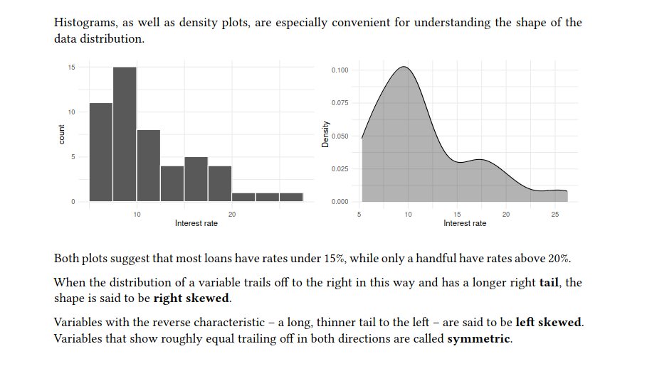
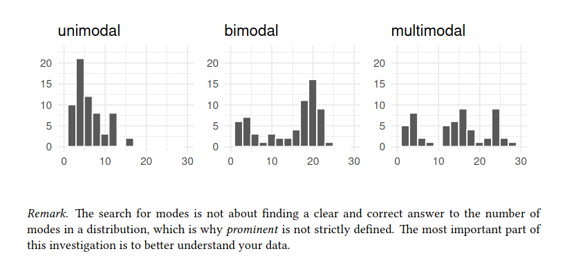
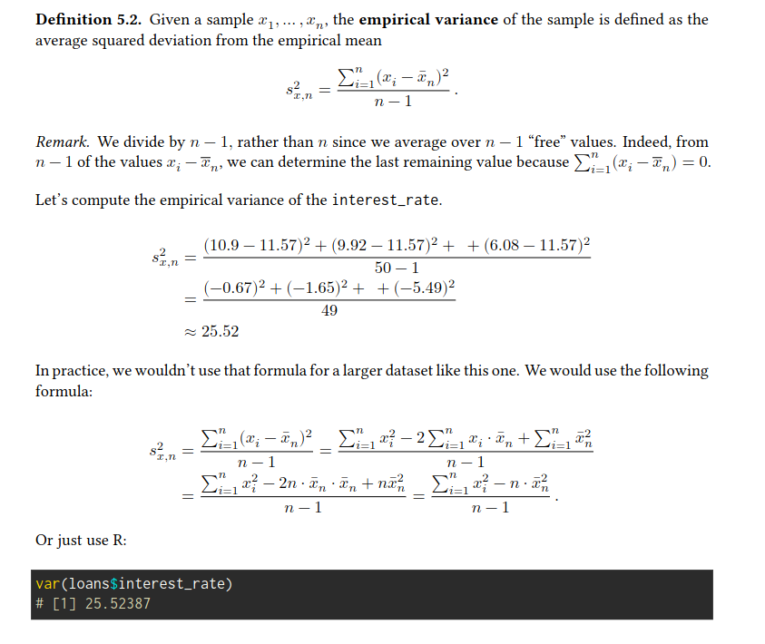
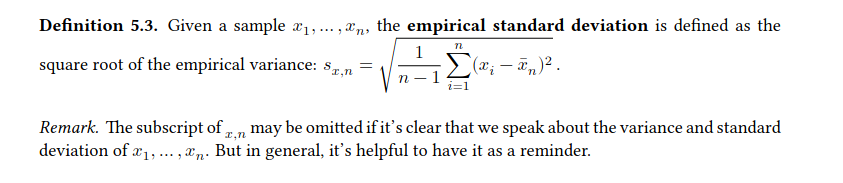

## Exploring Numerical Data
###### Dot plots and the mean:
> we work again with the loan data from the Lending Club. But this time, we are
considering only a subsample of size 50. In addition, we select just some of the variables

visualizing the shape of the distribution of a single variable.
```
ggplot(
 loans,
 aes(x = interest_rate)
 ) +
 labs(x = "Interest rate") +
 geom_dotplot()
```
###### Empirical mean:
>The empirical mean, often called the **average** or **sample mean**, is a common way to measure the center of a distribution of data
$$ \bar{x}_{n} = \frac{x_1 + x_2 + ... + x_n}{n} $$  

> The **population mean** is often denoted as 𝜇. Sometimes a subscript, such as 𝑥, is used to represent which variable the population mean refers to.  
Often it is too expensive or even not possible (population data are rarely available) to measure the population mean 𝜇 precisely. Hence we have to estimate 𝜇 using the sample mean $\bar{x}$

We can use summarize() from the dplyr package to **summarize** the data by computing the sample mean of the interest rate:
```
loans |>
 summarize(
  mean_ir = mean(interest_rate)
  )

# # A tibble: 1 x 1
#   mean_ir
#   <dbl>
# 1  11.6
```
The sample mean is a **point estimate** of 𝜇𝑥. It’s not perfect, but it is our best guess of the average interest rate on all loans in the population studied.  
Later, we will discuss methods for assessing the accuracy of point estimates, which is necessary because accuracy varies with the sample size
```
mean(loans$interest_rate)

# [1] 11.5672
```
###### Group means:
```
loans |>
 group_by(grade) |>
 summarize(
 mean_ir = mean(interest_rate)
 )

# # A tibble: 5 x 2
# grade mean_ir
# <fct> <dbl>
# 1 A 6.77
# 2 B 10.2
# 3 C 13.8
# 4 D 18.6
# 5 E 25.6
```
After the group_by() step, all computations are performed separately for each level of grade.  
We detect an increasing average interest rate with a decreasing grade.

###### Histograms and shape:
Dot plots show the exact value for each observation. They are useful for small datasets but can become hard to read with larger samples.  
Especially for larger samples, we prefer to think of the value as belonging to a **bin**. For the loans dataset, we created a table of counts for the number of loans with interest rates between 5.0% and 7.5%, then the number of loans with rates between 7.5% and 10.0%, and so on.
```
loans |>
 pull(interest_rate) |>
 cut(breaks = seq(5, 27.5, by = 2.5)) |>
 table()

#
# (5,7.5] (7.5,10] (10,12.5] (12.5,15] (15,17.5] (17.5,20]
# 11 15 8 4 5 4
# (20,22.5] (22.5,25] (25,27.5]
# 1 1 
```
These binned counts are plotted as bars in a histogram.
```
ggplot(
 loans,
 aes(x = interest_rate)) +
 geom_histogram(
    breaks = seq(5, 27.5, 2.5),
    colour = "white") +
  labs(x = "Interest rate")
```

>Histograms provide a view of the **data density**. Higher bars represent where the data are relatively more common.
A smoothed-out histogram is known as a **density plot**.
```
ggplot(loan50, aes(x = interest_rate)) +
 geom_density(fill = "black", alpha = 0.3) +
 labs(x = "Interest rate", y = "Density")
```


###### Modality: 
In addition to looking at whether a distribution is skewed or symmetric, histograms can be used to identify modes.  
A **mode** is a **prominent peak** in the distribution. There is only one prominent peak in the histogram of interest_rate.



###### Variance and standard deviation
Here, we introduce two related measures of variability: **the empirical variance** and the **empirical standard deviation**. The standard deviation roughly describes how far away the typical observation is from the mean. We call the distance of an observation $x_i$ from its empirical mean̄ $\bar{x}_n$ its deviation $x_i - \bar{x_n}$.  
If we square these deviations and then take an average, the result is equal to the empirical variance.


The empirical standard deviation is the square root of the empirical variance.   

> the population values for variance and standard deviation have typical symbols:
$\sigma²$ for the variance and $\sigma$ for the standard deviation.

```
loans |>
 summarize(
 var_ir = var(interest_rate), sd_ir = sd(interest_rate)
 )

# # A tibble: 1 x 2
#   var_ir sd_ir
#   <dbl> <dbl>
# 1  25.5 5.05
```

###### Box plots, quartiles, and the median
>A box plot summarizes a dataset using five statistics while also identifying unusual observations. The dark line inside the box represents the **empirical median**

###### Median:
At least 50% of the data are less than or equal to the median, and at least 50% are greater than or equal to it.  
The empirical median is the value that splits the data in half when ordered in
ascending order.

**Remark.** When there is an odd number of observations, there will be precisely one observation that splits the data into two halves, and in such a case, that observation is the median.  
The empirical median can be computed in several ways for 𝑛 being an even number. One common approach is to define the empirical median of a sample 𝑥1, … , 𝑥𝑛 to be the average $\frac{1}{2}(x_{\frac{n}{2}} + x_{\frac{n}{2} + 1})$
where $x_k$ is the 𝑘-th smallest value.

The 𝑘𝑡ℎ **percentile** is a number with at least 𝑘% of the observations below or equal to and at least 100 − 𝑘% above or equal to.

###### Interquartile range, whiskers and outliers
The box in a box plot represents the middle 50% of the data. The length of the box is called the **interquartile range**, or **IQR** for short.


Like the standard deviation, the IQR is a **measure of variability** in data. The more variable the data, the larger the standard deviation and IQR.  

**The whiskers** attempt to capture the data outside of the box.
The whiskers reach to the minimum and the maximum values in the data, unless there are points that are considered unusually high or unusually low:  
 **$>$ 1.5 times the IQR away from the first or the third quartile** which are labeled with a dot and referred to as potential **outliers**.


An **outlier** is an observation that appears extreme relative to the rest of the data. Examining data
for outliers serves many useful purposes, including:
- identifying strong skew in the distribution,
- identifying possible data collection or data entry errors, and
- providing insight into interesting properties of the data.  

However, remember that some datasets have a naturally long skew, and outlying points do not represent any sort of problem in the dataset

##### Comparing numerical data across groups:
Side-by-side boxplots is a common tool to compare the distribution of a numerical variable across groups.
```
ggplot(loans, aes(
 x = interest_rate,
 y = grade
 )) +
 geom_boxplot() +
 labs(
 x = "Interest rate (%)",
 y = "Grade",
 title = "Interest rates of Lending Club loans",
 subtitle = "by grade of loan"
 )
```

When using a histogram, we can fill the bars with different colors according to the levels of the categorical variable.
```
ggplot(loans, aes(
 x = interest_rate,
 fill = homeownership
 )) +
 geom_histogram(binwidth = 2, colour = "white") +
 labs(
 x = "Interest rate (%)",
 title = "Interest rates of Lending Club loans"
 ) 
```
With the position argument of geom_histogram(), one can vary where to put the bars for the different groups. The default is to put them on top of each other. The **dodge** position puts them next to each other.

Another technique for comparing numerical data across different groups would be **faceting**.
```
ggplot(loans_full_schema,
 aes(x = interest_rate)) +
 geom_histogram(
 bins = 10, colour = "white") +
 facet_grid(term ~ homeownership)
```
