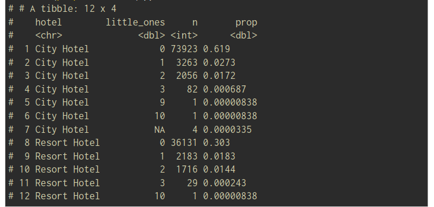

## 3 Grammar of data wrangling

>In this chapter, the **dplyr** package of tidyverse is introduced. It is a grammar of data manipulation, providing a consistent set of verbs (=functions) that help you
solve the most common data manipulation challenges.

The main verbs are:

- **select:** pick columns by name,
- **arrange:** reorder rows,
- **filter:** pick rows matching criteria,
- **mutate:** add new variables,
- **summarise:** reduce variables to values.

<div style='background-color:gray;'>
<span>
For all dplyr functions: 
<ul>
<li>the first argument is always a data frame</li>
<li>the subsequent arguments say what to do with that data frame</li>
<li>always return a data frame</li>
<li>don’t modify in place</li>
</ul>
</div>

#### Data I/O:

The tidyverse toolbox for data input/output is the **readr** package. It is one of the core tidyverse
packages loaded when loading the tidyverse. Since we already loaded the tidyverse, readr is ready
for usage.  

The most general function for reading in data is **read_delim()**. Several variants with respect to the
relevant field separator exist to make our lives easier. In our case, it is a comma. Therefore, we use **read_csv()** (in case of a semicolon, it would be **read_csv2()**).
```
hotels <- read_csv("/data/hotels.csv")
```

###### Select - extracting columns:
select(dataframe, ...variable)
```
select(
    hotels,
    lead_time
)
```
In this example, hotels and the output of select() are a **tibble**, which is a special kind of
data frame. In particular, it prints information about the dimension of the data and the type
of the variables. Most of the time we will work with tibbles.

###### Arrange:
>By default, arrange() will order the entries ascendingly. 
```
arrange(
    select(hotels
           hotel, lead_time),
    desc(lead_time)
)
```
A more efficient way of combining several steps into one command is to use **Pipes**

###### Pipes:
> The pipe operator |> : a technique for passing information from one process to another.

By default, the object on the left is passed as the first argument of the function on the right. The
native pipe also has a placeholder option, allowing objects to be passed to a specific argument.
```
hotels |>
    select(hotel, lead_time) |>
    arrange(desc(lead_time))
```
**Remark:** dplyr knows it’s own pipe operator %>%, which is actually implemented in the package magrittr. This operator is older but has the drawback of working only in an “extended tidyverse”

###### Piping vs layering: 
We use |> mainly in dplyr pipelines: we pipe the output of the previous line of code as the first input of the next line of code 
We use + in ggplot2 plots for “layering”: we create the plot in layers, separated by +

###### Helper functions in combination with select()
- starts_with(): Starts with a prefix
- ends_with(): Ends with a suffix
- contains(): Contains a literal string
- num_range(): Matches a numerical range like x01, x02, x03
- one_of(): Matches variable names in a character vector
- everything(): Matches all variables
- last_col(): Select last variable, possibly with an offset
- matches(): Matches a regular expression (a sequence of symbols/characters expressing a
string/pattern to be searched for within text)

```
hotels |>
    select(starts_with("arrival"))
```
###### Filter rows:
>The subsequent filter() arguments specify conditions that need to be fulfilled by a row (= an ob-
servation) to become part of the output.
>We can specify multiple conditions, which will be combined with an &.
```
hotels |>
    filter(
        adults == 0,
        children >= 1
    ) |>
    select(adults, babies, children)
```
>If two (or more) conditions should be combined with an “or”, we must do this explicitly using the |
operator.
```
hotels |>
    filter(
        adults == 0,
        children >= 1 | babies >= 1 
    ) |>
    select(adults, babies, children)
```
>In some cases, we might be interested in the unique observations of a variable. That’s when we want
to use the **distinct()** function
>Combining distinct() with arrange() leads to a friendlier output to read through the fact being
ordered.
```
hotels |>
    distinct(hotel,
             market_segment) |>  #distinct combinations
    arrange(hotel, market_segment)
```
###### Slice for specific row numbers: 
>If we know which rows to extract, slice() can do the job.
```
hotels |>
    slice(1:5) # first five
```

```
slice_head(df, n = 1, by = group) # first row from each group.
slice_tail(df, n = 1, by = group) # last row in each group.
slice_min(df, x, n = 1) # smallest value of column x.
slice_max(df, x, n = 1) # largest value of column x.
slice_sample(df, n = 1) # one random row.
```

###### Adding or changing variables with mutate()
Imagine that it’s not essential for the analysis to distinguish between children and babies. Instead, we would like to have the number of little ones (children or babies) staying in the room.  
```
hotels |>
    mutate(little_ones= children + babies) |>
    select(children, babies, little_ones) |>
    arrange(desc(little_ones))
```
>count the combinations of how many bookings for all possible combinations of hotel and little ones:

```
hotels |>
    mutate(little_ones = children + babies) |>
    count(hotel, little_ones) |>  #count creates a further column n
    mutate(prop = n / sum(n))
```


###### Tidyverse style guide
>Good code styling is not necessary but is highly beneficial. The readability of your code is something you benefit from the most.

The **styler** package provides functions for converting code to follow a chosen style.  
By using the styler addin for the RStudio IDE, it makes it even easier than that.

