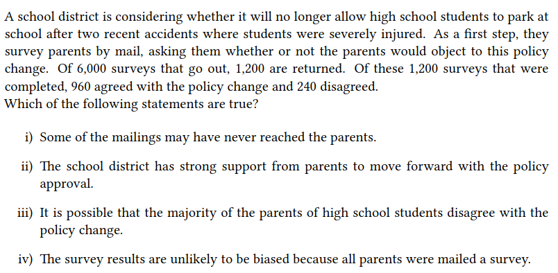

## 1 Intro to Data

###### Case Study: 
In statistical experiments,**the treatment group** is the group that receives the intervention or treatment being studied, while **the control group** is similar but does not receive the treatment. This setup helps researchers compare the effects of the treatment against no treatment or against a standard treatment, if one exists.

###### Do the data show a “real” difference between the groups? 
If the difference is quite large, it is more believable that the difference is real.
**Conclusion:** We need statistical tools to determine quantitatively if the difference is so large that we
should reject the notion that it was due to chance.

#### Data Basics:

<b>Types of Variables</b>

The type of a variable is one of the following:
<ul>
<li> Numerical: Variable can take a wide range of numerical values, and it is sensible to add, subtract, or take averages with those values. </li>
<li> Categorical: Variable has a finite number of values, which are categories (called levels),
and it is not sensible to add, subtract, or take averages with those values.</li>
</ul>
 

Categorical variables can be further distinguished as:
<ul>
<li> ordinal: the levels of the variable have a natural ordering, or</li>
<li> nominal: the levels of the variable don’t have a natural ordering</li>
</ul>

 

#### Relationships among variables: 
When two variables show some connection with one another, they are called **associated** or **dependent** variables.
Conclusion: If two variables are not associated, i.e., there is no evident connection between them, they are said to be **independent**.

##### Explanatory and response variables:

When we suspect one variable might causally affect another, we label the first variable the explanatory variable and the second the response variable.

 

Labeling variables as explanatory and response does not guarantee the relationship between
the two is causal, even if an association is identified between the two variables.

##### Populations and samples:
###### Census
Wouldn’t it be better to just include everyone and “sample” the entire population?
This is called a census. There are problems with taking a census:
1. It can be difficult to complete a census: there always seem to be some subjects who are hard to
locate or hard to measure. And these difficult-to-find subjects may have certain characteristics
that distinguish them from the rest of the population.
2. Populations rarely stand still. Even if you could take a census, the population changes con-
stantly, so it’s never possible to get a perfect measure.
3. Taking a census may be more complex than sampling.  

###### From exploratory analysis to inference
**Exploratory analysis:**
You taste a spoonful of soup and decide the spoonful you tasted isn’t salty enough.  
**Inference:**
You generalize and conclude that your entire soup needs salt.

###### Sampling Bias

<ul>
<li><b>Non-response:</b> If only a small fraction of the randomly sampled people chooses to respond to a survey, the sample may no longer be representative of the population. </li>
<li><b>Voluntary response:</b> The sample consists of people who volunteer to respond, because they have strong opinions on the issue. Such a sample will also not be representative of the population</li>
<li><b>Convenience sample:</b> Individuals who are easily accessible are more likely to be included in the sample.</li></ul>

    
Show Answer

     i and iii

#### Observational studies and experiments

<ul>
<li> If researchers collect data in a way that does not directly interfere with how the data arise, i.e.,
they merely “observe”, we call it an <b>observational study</b>.
In this case, only a relationship between the explanatory and the response variables can be
established. </li>
<li> If researchers randomly assign subjects to various treatments in order to establish causal connections between the explanatory and response variables, we call it an <b>experiment</b>.</li>
</ul>

